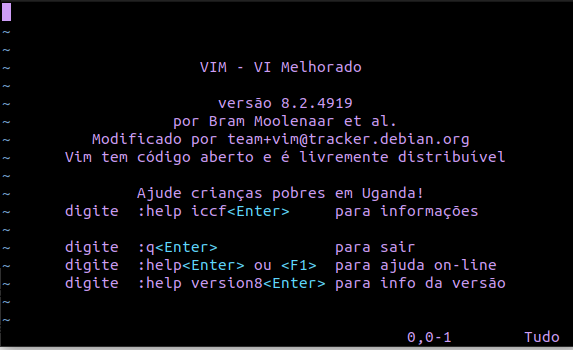
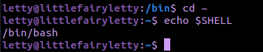
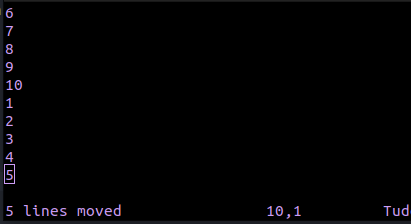
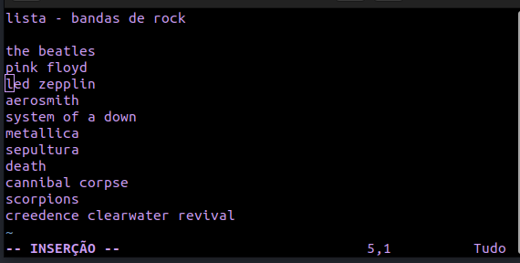
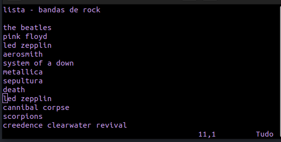
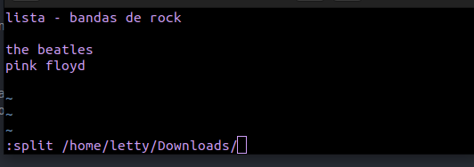
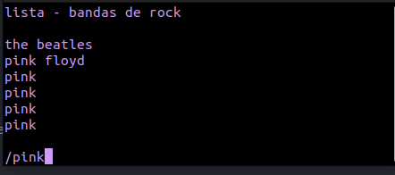
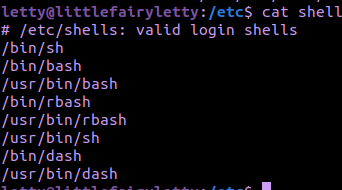
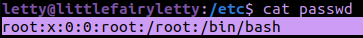

# Aula 02 - Edição de textos e Interpretadores de comandos mais utilizados

Resumo:

```bash
    - Editor Vim 
    - Linhas de comandos no vim
    - extra: Editor nano
```

## 5) Edição de textos


O editor de texto mais utilizado em um sistema linux é o **vim**.

Para verificar se o vim está instalado abra o terminal e digite "vim".

Se aparecer uma tela assim é porque está.



Caso contrario, digite:

Debian/Ubuntu: (Distribuição utilizada pelo professor)

```shell
sudo apt install vim
```

Arco:

```shell
sudo pacman -S vim
```

Fedora:

```shell
sudo dnf install vim-enhanced
```

### Modos

O vim é baseado em 2 modos:

- > Comando: Esse é o modo onde são executados os comandos, e também é o modo padrão onde o vim é iniciado.
- > Insert/Replace: Modo onde você insere, ou seja, escreve o texto.

Como o vim é inicializado no modo comando, para ir para o modo insert aperte a tecla **i**, e comece a digitar o seu texto.

Para voltar ao modo comando aperte **Esc**.

No vim não se utiliza o mouse, então se quiser navegar pelo seu código ou texto utilize as teclas **h**, **l**, **k** e **j**. Para saltar para o inicio de uma palavra utilize **w** e para o final da palavra utilize **e**. Para ir para uma nova linha **o**.

Lembre-se que todos esses comandos tem que ser utilizados no modo **comando** e não no modo **insert**.

No modo **comando** é onde também salvamos e sairmos do vim. Utilize **:w** (: antes de qualquer comando para salvar e sair do vim) para salvar o arquivo, **:wq** para salvar e sair do arquivo, **:q** para sair sem salvar do arquivo, **:q!** força sair do arquivo sem salvar caso ocorra algum erro, **:wqa** também é usado para salvar e sair do vim, mas diferente do **:wq** ele salva todos os arquivos do vim, a significa all.

Outros comandos da apostila do professor são, **:shell** que sai temporariamente do vim para o terminal sem necessariamente fechar o vim, você pode retornar ao vim com o comando **ctrl+d**, comando muito util para caso precise utilizar o terminal sem precisar fechar o arquivo ou abrir outro terminal. Outro comando mostrado na apostila é o **:X** (em maiúsculo) que é usado para critografar o arquivo. Conversando com o professor a criptografia utilizada no Debian é o "blowfish2". Para saber o tipo de critografia está sendo utilizada digite o comando, no modo comando(esc):

```shell
:set cryptmethod?
```

Ainda no modo comando, para **mover linhas** em uma posição específica no texto, pode ta utilizando o comando:

```shell
:intervalo mov posição
:1,5 mov 10
irá mover as linhas de 1 a 5 para a linha 10
```

Exemplo:






#### Para copiar linhas

```shell
yy - seleciona a linha do cursor
p - cola na linha abaixo do cursor
```

O **yy** vai selecionar a linha onde está o cursor e o **p** vai colar a linha selecionada abaixo do cursor.

Exemplo:



No exemplo acima foi utilizado 13 linhas, o cursor está na linha 5, no modo comando foi utilizado o **yy**, na linha 10 será utilizado o comando **p**.



Já o comando **y2** seleciona a linha atual do cursor e mais duas linhas abaixo, o **y3** seleciona a linha atual do cursor e mais três linhas abaixo e assim sucessivamente. Depois é só usar o comando **p**.

#### Apagar linhas

Fuciona parecido com o **yy**, o comando **dd** vai apagar a linha na posição do cursor, o **d3** apaga a linha do cursor e mais três abaixo, e o comando **u** recupera linhas que foram apagadas, similar ao ctrl+z.

#### Dividir tela

É possível didivir a tela do vim com um diretório/arquivo utilizanddo o comando:

```shell
:split /diretório
```

Exemplo:



O diretório é aberto a partir do diretório raiz.


O comando ctrl+ww altera entres os arquivos. E **:only** para desfazer as divisões.

#### Busca

Para fazer um busca entre o texto é utilizado o comando **/palavra-procurada**.



Pode utilizar o **n** para buscar outra palavra igual após apertar **enter**.

#### Manual

Por último, o comando **:h** faz aparecer o manuel do editor vim.

Mesmo depois disso tudo se você acha o vim difícil, é porque de fato é, saia do vim e abra o vscode/atom/sublime/IntelliJ ou qualquer outra editor de sua escolha e seja feliz.

## 6) Interpretadores de comandos mais utilizados

Reusmo:

```bash
    - sh, bash, csh, tcsh, ksh
    - Ecadeamento de comandos
```

Os interpretadores de comando, conhecidos também como shells, são os programas responsáveis em interpretar as intruções enviadas pelo usuário ao sistema operacional(Kernel). É no shell que é executado os comandos lidos por um dispositivo de entrada padrão, como o teclado e os arquivos executáveis. Tenha em mente que o shell é a principal ligação entre o usuário, programas e o kernel.

O GNU/Linux possui diversos tipos de interpretadores de comandos, entre eles são: bash, ash, csh, tcsh, sh, etc. O mais usado é o bash.

Os comandos ser enviados de duas maneiras para o interpretador, de mandeira interativa e não-interativa.

### Modo interativo

No modo interativo, os comandos são digitados pelo usuário em uma interface de linha de comando(como o terminal), e cada comando é inserido e enviado ao interpretador um por um, e o interpretador responde imediatamente após a execução de cada comando.

Por exemplo, comandos como **cd** que entrar e sai de diretórios, **cp** que copia arquivos, **ls** que lista arquivos/diretórios são comandos que podem ser executados de movo interativo se executados um a um no terminal.

### Modo não interativo (ou modo script)

Já nesse modo os comandos oa armazenados em um arquivo script (como .sh, de shell) criado pelo usuário. O arquivo de script irá conter uma lista de comandos que serão executados na ordem em que vão estar listado no arquivo. Nesse modo o computador vai lê e executar cad comando do arquivo de script, sem a necessidade de intervenção do usuário para digitar cada comando.

Por exemplo, você pode criar um arquivo chamado **backup.sh** que contém comandos como **cp** para copiar arquivos para um diretório backup. Para executar o arquivo é só usar **./backup.sh** no terminal.

**Sobre os tipos de interpretadores mais utulizados:**

> **sh:** Foi o primeiro shell desenvolvido para sistemas UNIX pelo Stephen Bourne. É um shell nível básico, que contém poucos recursos de comandos, mesmo assim ainda é amplamente utilizado.

> **ksh:** Também conhecido como Korn Shell, criado pelo David Korn como uma alternativa ao **sh**. Inclue expressões aritméticas e manipulação de strings.

> **csh:** Também conhecido como C Shell, foi desenvolvido pela Universidade de Berkeley. Ele possuo uma sintxe diferenciada parecido com a linguagem C.

> **tcsh:** É uma extensão do C Shell, oferece recuros adicionais. É popular entre alguns usuário que preferem uma interface mais amigável.

> **bash:** O shell padrão do GNU e evolução do **sh**. Ele oferece um amplo recursos de comandos, é altamente configurável e suporta scripts de shell, permitindo a automação de tarefas.

### Algumas observações

1- O Linux é **case-sensitive**, ou seja, tem diferença entre digitar um comando em maiúsculo e minúsuclo.

2- No Linux tipo GNU, utulizado nas aulas, o shell padrão é o **bash**.

3- No diretório /etc, que está localizado na pasta raiz do sistema (use **cd/** para ir para pasta raiz), contém o arquivo **shells**.
Dê olhado utilizando o comando **ls -l etc/shells**.


O arquivo **/etc/shells** é um arquivo de texto simples que lista os interpretadores de comandos (shells) disponíveis no sistema, o usuŕio pode optar por mudar o tipo do shell entre os listados, utlizando o comando **chsh**:



```bash
chsh -s /caminho/do/novo/shell
```

Quando você usa o **chsh** para alterar o shell, ele atualiza o campo "Shell" no arquivo **/etc/passwd** com o caminho completo para o novo shell escolhido pelo usuário.
Por exemplo, ao executar o ```chsh -s /bin/dash``` o campo "Shell" no arquivo /etc/passwd para esse usuário será atualizado para /bin/dash.

O arquivo ```/etc/passwd``` é um arquivo de texto que armazena informações sobre as contas de usuário no sistema Linux, como o nome do usuário, senhas critografadas, diretório inicial do usuário, o shell padrão do usuário e etc.

Exemplo:



No meu sistema o shell padrão do root é o bash.

4 - Você pode temporariamente utilizar outro tipo de shell diferente do seu usário digitando o nome do shell e retornar para o shell padrão utilizando ```ctrl+d```.


5- Para saber qual o tipo de shell está sendo utilizado use o seguinte comando: ```echo $SHELL```.


6 - Você pode utilizar mais de um comando de uma vez se utilizar **&&** , **||** , **;**.


## 6.1) Encadeamento de comandos

1. ; - executa os comandos um após o outro, de forma independente.
2. && - o segundo comando só vai ser executado se o primeiro comando funcionar.
3. || - o primeiro comando só vai ser executado se o primeiro comando falhar.

## Extra: Alguns comandos utilizados na sala

```cd``` -> Usado para entrar e sair de diretório:

```cd <diretório>``` : vai entrar no diretório especificado

```cd ..``` : vai para o diretório anterior ao atual

```cd /``` : vai para o diretório raiz

```cd ~``` : vai para o diretório pessoal

```cd .``` : permanence no diretório atual (útil para scripts)

---

```rm``` -> remove arquivos e diretórios

```rm <arquivo>```

```rmdir <diretório>```

---

```mkdir``` -> criar diretórios

---

```pwd``` -> exibe sua localização do terminal (diretório atual).

## conteudo da aula concluido

## conteudo extra concluido
