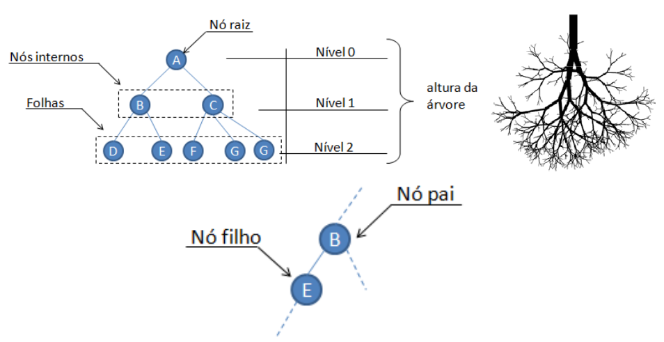
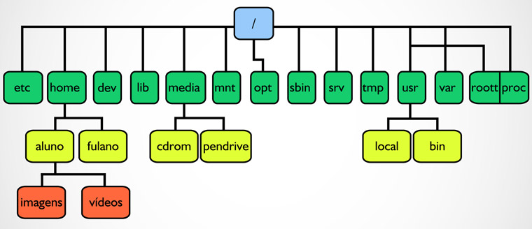
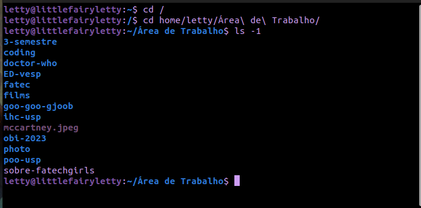
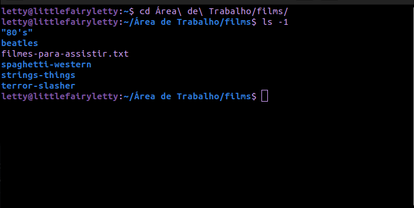
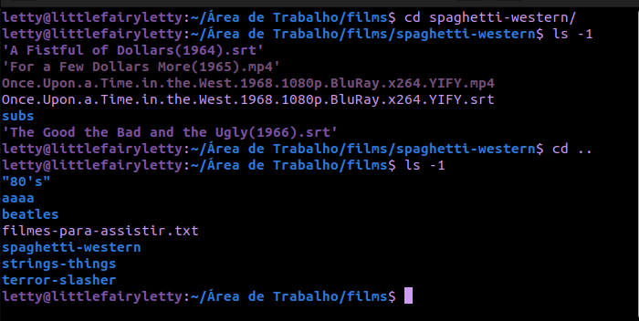
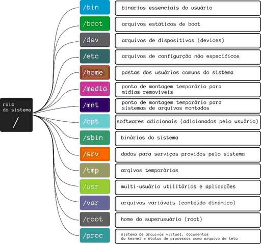
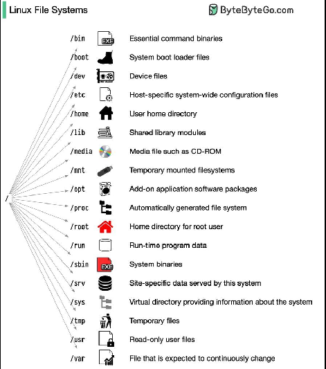
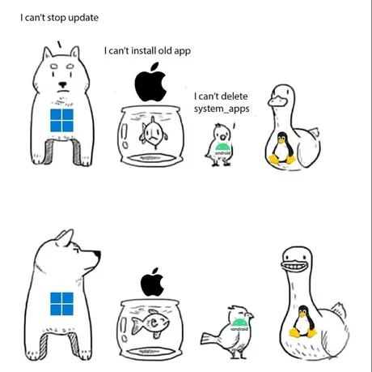

# Aula 03 - Arquivos e Diretórios

```bash
Resumo:
- Caminho absoluto e caminho relativo.
- Estrutura padrão dos diretórios (stnfds).
```

## 7) Diretórios e arquivos

Os diretórios são estruturas que servem para organizar e agrupar arquivos e outros diretórios em um sistema operacioal. Eles são organizados de forma hierárquica, por exemplo:



Relembrando as aulas de análise de algoritmos com o professor Silvio, a gente estudou sobre árvore. Ela tem uma raiz lá em cima, que é denomiado topo, e depois tem uns galhos que saem dela, que são os filhos, como na imagem.

No sistema operacional linux os diretórios são organizados da mesma forma. Onde o nível mais alto, o topo, é o diretório raíz, identificado como ```/```, a partir dele derivam todos os outros diretórios do sistema como em uma árvore.



Para encontrar a localização de um arquivo ou diretório existem duas formas:

-> Caminho absoluto: No diretório raiz, use o comando ``` cd / ``` para chegar lá, inicie por uma **/** e vá selecionando todos os diretórios no caminho até chegar no arquivo ou diretório desejado.

Exemplo:

```bash
cd /
/home/letty/Área\ de\ Trabalho/
```



E assim chegamos a minha área de trabalho atráves do caminho absoluto a partir do diretório raíz.

Obs: É uma boa pratica salvar arquivos e diretórios sem separações, por exemplo isso-e-um-diretorio, pois no shell os espaçamentos são caracteres especiais, e a barra invertida ``` \ ``` é usada como um caracter para informar ao shell que o espaço não deve ser interpretado como um separador, mas sim como parte do nome do diretório.

Por exemplo, quando digitamos o comando ``` ls -lh ``` tem um separador entre o ls e -lh, e para o shell saber que Área de Trabalho é o nome do diretório e não uma sequência de comandos, deve usar o \ entre cada espaçamento.

Então, é comum a prática de evitar espaços e caracteres especiais ao nomear arquivos e diretórios no linux, use **_**, **-** ou até separe assim **IssoEUmArquivo**.

-> Caminho relativo: Outro meio de se chegar a um arquivo ou diretório, é a partir da posição atual que se encontra no terminal. Ao contrário do caminho absoluto, que começa da raíz, ese vai usar a sua localização atual. Formas de usar:

1- Para saber seu diretório atual use o comando ``` pwd ```.

2- No sistema linux os diretórios são separados por barras **/**. Então vamos supor que você deseja acessar o diretório **films** que está localizado na Área de Trabalho e seu diretório atual seja **/home/letty**, você usára o caminho relativo /Área\ de\ Trabalho/films para chegar até lá, sem precisar ir até a raíz.



3- Sobre os pontos: (.) e (..), o (.) representa o diretório atual, enquanto o (..) representa o diretório pai do atual, então quando usamos o comando ``` cd .. ``` estamos acessando o diretório pai do diretório atual, em outras palavras estamos "voltando um diretório.




Os arquivos são objetos digitais que contêm dados ou informações. Eles podem ser criados por um processo de computador ou por meio de comandos dados por um usuário. E todos os arquivos devem possuir um nome e uma extenssão.

A extensão de um arquivo é geralmente uma parte do nome do arquivo que segue um ponto (.) e é usada para indicar o tipo de arquivo, por exemplo, um arquivo de texto pode ter a extensão **.txt**, enquanto um arquivo de imagem pode ter a extensão **.jpg** ou **.png**. No entanto, as extensões não são obrigatórias para todos os tipos de arquivos.

Os arquivos podem ter duas extensões, por exemplo, prog.c.z, o **.c** indica que um arquivo código fonte da linguagem C, e o **.z** que é um arquivo compactado o usando o Gzip.

Exsitem 3 formas de executar um arquivo de comandos (shell script):

```bash
sh < hello.sh
```

```bash
sh hello.sh
```

E tem o método que envolve duas etapas. Primeiro, você concede permissão de execução ao arquivo arqcomp usando o comando chmod. O a+x que adiciona permissão de execução a todos, ou seja, usuário, grupo e outros. Em seguida, você executa o arquivo diretamente usando ./arqcomp. O ./ indica que o arquivo está no diretório atual.

```bash
chmod a+x hello.sh
./hello
```

ou

```bash
chmod a+x hello.sh && ./hello
```

O **&&** como foi ensinado na aula anterior, indica que que o segundo comando só vai ser executado se o priemiro tiver sido executado com sucesso.

Para executar um arquivo compilado basta utilizar o ```./arquivo```, se ele já tiver sido compilado.

## 7.1) Estrutura padrão dos diretórios (stndfs)

Chamamos de sistemas de arquivos, a estrutura lógica da árvore de diretórios. Essa estrutura é formada pela raiz do sistema, representada pelo diretório barra (/), e pelos subdiretórios abaixo dessa raiz.

A localização dos diretórios e de alguns arquivos essenciais, é definida no documento Filesystem Hierarchy Standard (FHS). O sistema de arquivos FHS é específico das distribuições GNU/Linux que seguem o padrão LSB - Linux Standard Base.



Veja mais [aqui](https://mange.ifrn.edu.br/site/doc-ubuntu-fr2pt_br/arvore-de-diretorios.html) ou [aqui](http://tics.ifsul.edu.br/matriz/conteudo/disciplinas/so/uc/1/2.html)

Também tem essa imagem mais explicativa:



## Bibliografia

- [Guia Foca GNU/Linux](https://www.ppgia.pucpr.br/pt/arquivos/techdocs/linux/foca-iniciante/ch-perm.html)

## conteúdo da aula concluído


