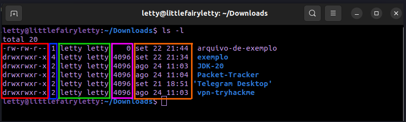
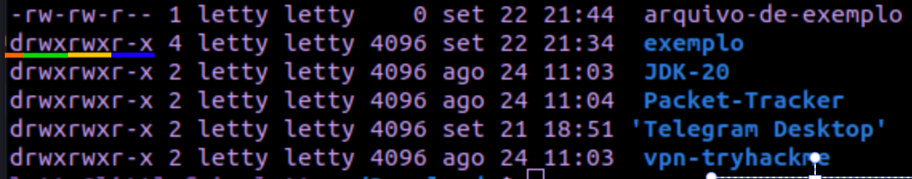

# Aula 04 - Diretórios e arquivos

## Resumo

```bash
  - Tipos de arquivos
  - Mudando permissões de arquivos e diretórios
    - Formato simbólico
```

## 7.2) Tipos de Arquivos

comando ls:

```shell
ls
```

Utilizado para listar arquivos e diretórios não ocultos no diretório atual


No exemplo acima o comando **ls** listou os arquivos e diretórios JDK-20, Packet-Tracker, Telegram-Desktop e vpn-tryhackme dentro do diretório atual (Download).

Mas também existe outras formas de se utilizar o comando **ls**, por exemplo:

Se utilizamos o ```ls -a``` podemos listar todos os arquivos e diretórios em um diretório, incluindo os arquivos ocultos. :D


O arquivo ```.arquivo-oculto``` foi listado juntos aos outros arquivos e diretórios com o comando **ls -a**.

Existe muitas opções de se utilizar o comando **ls**, basta utilizar a sintaxe:

```shell
ls [opção]
```

Aqui estão algumas opções úteis:

**-a** (ou --all): Lista todos os arquivos, incluindo os arquivos ocultos (aqueles que começam com um ponto . no inicio)

**-l** (ou --long): Exibe detalhes completos sobre arquivos e diretórios. Isso inclui informações como permissões de arquivo, proprietário, grupo, tamanho, data de modificação e nome do arquivo. (vamos ver sobre isso mais para frente)

**-h** (ou --human-readable): Quando usado junto com a opção -l, -h torna os tamanhos de arquivo legíveis por humanos, convertendo-os em formatos como "K" (quilobytes), "M" (megabytes) e assim por diante, para facilitar a leitura.

```shell
ls -lh
```

**-R** (ou --recursive): Lista os diretórios de forma recursiva, exibindo o conteúdo dentro do diretórios (os subdiretórios).


**-t** (ou --time): Ordena a saída com base na data de modificação dos arquivos, mostrando os arquivos mais recentemente modificados primeiro.

**-S** (ou --size): Classifica a saída com base no tamanho dos arquivos, exibindo os arquivos maiores primeiro.

**-r** (ou --reverse): Inverte a ordem de classificação da saída, exibindo-a em ordem reversa.

**-d** (ou --directory): Quando usado com nomes de diretórios, essa opção faz com que o ls liste apenas o diretório do comando.

**-1** (um número um): Essa opção força a exibição de cada arquivo ou diretório em uma única linha, útil para listar muitos itens.


Agora falando sobre o comando ```ls -l```, ele lista os arquivos do diretório, cada um em um linha, com várias informações, como permissões de arquivo, proprietário, grupo, tamanho, data de modificação e nome do arquivo, veja aqui:


Essas informaçõessão separadas em colunas de 1 a 7. A coluna 1 (drwxrwxr-x) estão as permissões do arquivo ou diretório, na coluna 2 -----, na coluna 3 e 4 estão respectivamente o usuário e grupo dono do arquivo/diretório, na  coluna 5 está o tamanho do arquivo/diretório, e na coluna 6 estão data e hora que o arquivo/diretório foi modificado ou criado (no linux ubuntu é mostrado a data, dia e mês, e a hora, já no Debian é mostado apenas a data incluindo o ano).

Exemplo:



- Coluna 1: vermelho
- Coluna 2: azul
- Coluna 3 e 4: verde
- Coluna 5: rosa
- Coluna 6: laranja

### Coluna 1

A primeira posição da coluna 1 indica o tipo da entrada:

**-** = um arquivo

**d** = um diretório

**l** = um link simbólico

**c** = um arquivo de dispositivo caractere

**b** = um arquivo de dispositivo de bloco

Note que no exemplo apenas a entrada "arquivo-de-exemplo" é um arquivo com um **-** na primeira posição, o restante são todos diretórios.

Após a primeira posição é divido em mais 3 posições de 3 quantidades cada que indica a permissão do dono (usuário), grupo do dono e outros.

Cada uma das 3 quantidades represente um tipo de permissão, sendo R (leitura), W (gravação) e X (se for um arquivo **-** representa a permissão de executar o arquivo, se for um diretório **d** representa a permissão de entrar dentro dele), também tem o **-** no lugar de um desses 3 (R-W-X) que representa que a permissão de um desses 3 é negada.

Exemplo:



Note que a única permissão negada nesse exemplo é de W (gravação) de outros, o usuário (letty) e o grupo do usuário (letty) tem todas as permissões entre os arquivos/diretórios.

### Coluna 2

em breve

## 7.3) Mudando permissões de arquivos e diretórios

logo em breve :D
