# Aula 04 - Diretórios e arquivos

## Resumo

```bash
  - Tipos de arquivos
  - Mudando permissões de arquivos e diretórios
    - Formato simbólico
```

## 7.2) Tipos de Arquivos

comando ls:

```shell
ls
```

Utilizado para listar arquivos e diretórios não ocultos no diretório atual

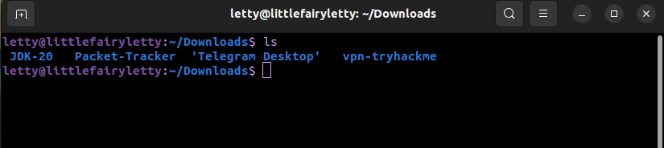

No exemplo acima o comando **ls** listou os arquivos e diretórios JDK-20, Packet-Tracker, Telegram-Desktop e vpn-tryhackme dentro do diretório atual (Download).

Mas também existe outras formas de se utilizar o comando **ls**, por exemplo:

Se utilizamos o ```ls -a``` podemos listar todos os arquivos e diretórios em um diretório, incluindo os arquivos ocultos. :D

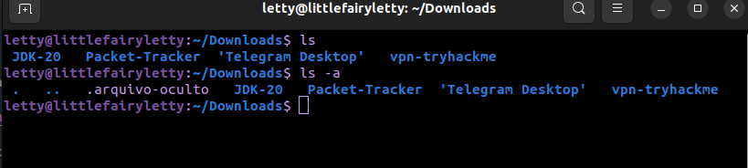

O arquivo ```.arquivo-oculto``` foi listado juntos aos outros arquivos e diretórios com o comando **ls -a**.

Existe muitas opções de se utilizar o comando **ls**, basta utilizar a sintaxe:

```shell
ls [opção]
```

Aqui estão algumas opções úteis:

**-a** (ou --all): Lista todos os arquivos, incluindo os arquivos ocultos (aqueles que começam com um ponto . no inicio)

**-l** (ou --long): Exibe detalhes completos sobre arquivos e diretórios. Isso inclui informações como permissões de arquivo, proprietário, grupo, tamanho, data de modificação e nome do arquivo. (vamos ver sobre isso mais para frente)

**-h** (ou --human-readable): Quando usado junto com a opção -l, -h torna os tamanhos de arquivo legíveis por humanos, convertendo-os em formatos como "K" (quilobytes), "M" (megabytes) e assim por diante, para facilitar a leitura.

```shell
ls -lh
```

**-R** (ou --recursive): Lista os diretórios de forma recursiva, exibindo o conteúdo dentro do diretórios (os subdiretórios).

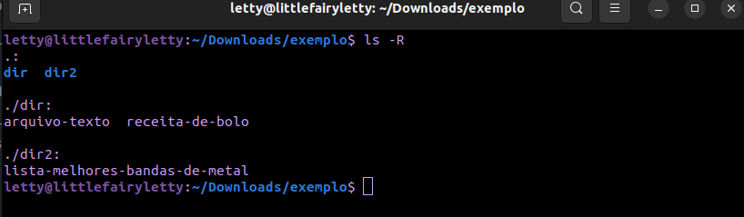

**-t** (ou --time): Ordena a saída com base na data de modificação dos arquivos, mostrando os arquivos mais recentemente modificados primeiro.

**-S** (ou --size): Classifica a saída com base no tamanho dos arquivos, exibindo os arquivos maiores primeiro.

**-r** (ou --reverse): Inverte a ordem de classificação da saída, exibindo-a em ordem reversa.

**-d** (ou --directory): Quando usado com nomes de diretórios, essa opção faz com que o ls liste apenas o diretório do comando.

**-1** (um número um): Essa opção força a exibição de cada arquivo ou diretório em uma única linha, útil para listar muitos itens.

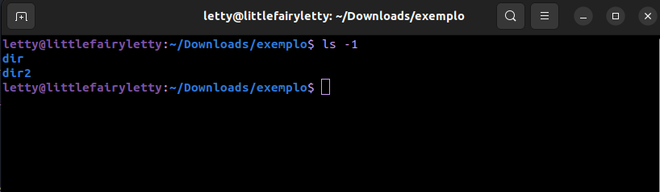

Agora falando sobre o comando ```ls -l```, ele lista os arquivos do diretório, cada um em um linha, com várias informações, como permissões de arquivo, proprietário, grupo, tamanho, data de modificação e nome do arquivo, veja aqui:

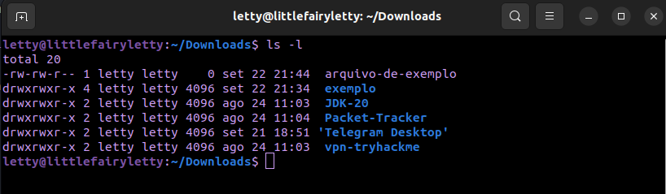

Essas informações são separadas em colunas de 1 a 7. 

A coluna 1 (drwxrwxr-x) estão as permissões do arquivo ou diretório. 

Na coluna 2 **FALTA PREENCHER AQUI**

Na coluna 3 e 4 estão respectivamente o usuário e grupo dono do arquivo/diretório

Na coluna 5 está o tamanho do arquivo/diretório

Na coluna 6 estão data e hora que o arquivo/diretório foi modificado ou criado (no linux ubuntu é mostrado a data, dia e mês, e a hora, já no Debian é mostado apenas a data incluindo o ano).

Exemplo:

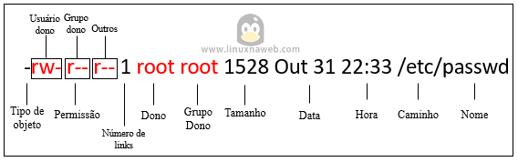

### Coluna 1

A primeira posição da coluna 1 indica o tipo da entrada:

**-** = um arquivo

**d** = um diretório

**l** = um link simbólico

**c** = um arquivo de dispositivo caractere

**b** = um arquivo de dispositivo de bloco

Note que no exemplo apenas a entrada "arquivo-de-exemplo" é um arquivo com um **-** na primeira posição, o restante são todos diretórios.

Após a primeira posição é divido em mais 3 posições de 3 quantidades cada que indica a permissão do dono (usuário), grupo do dono e outros.

Cada uma das 3 quantidades represente um tipo de permissão, sendo R (leitura), W (gravação) e X (se for um arquivo **-** representa a permissão de executar o arquivo, se for um diretório **d** representa a permissão de entrar dentro dele), também tem o **-** no lugar de um desses 3 (R-W-X) que representa que a permissão de um desses 3 é negada.

Exemplo:

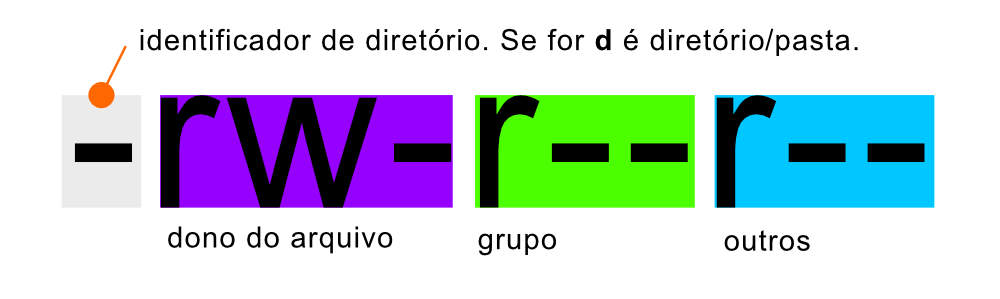

Note que a permissão negada nesse exemplo é execucação no usuário, gravação e executação no grupo e outros. E ele é um arquivo já que começa com um **-**, se fosse diretório começaria com **d**.

### Coluna 2

# REUSMIR AQUI

## 7.3) Mudando permissões de arquivos e diretórios

``` chmod ``` - É um comando que altera as permissões dos arquivos e diretórios, através de uma representação simbólica ou de um número octal.

### Formato Simbólico

|chmod em formato simbólico|
|------|
|```chmod [u g o a] {+ - =} {r w x s t} <arquivo>```|

O comando é divido em 3 partes, uma ou mais letras para indicar a quem vai ocorrer a mudança, um sinal indicando se vai adicionar, remover ou substituir, e uma letra que indicam as novas permissões do usuário.

Aqui será indicado **a quem** vai ocorrer essa mudança: **[ u g o a ]**

- **[ u ]** para indicar mudança para o dono do arquivo.

- **[ g ]** para indicar mudança para o grupo do dono.

- **[ o ]** para indicar mudança para outros usuários.

- **[ a ]** para todos.

Se não for digitado nenhuma letra será assumido ``` a ```.

Aqui será indicado **o que** vai ser essa mudança, remover, adicionar ou substituir: **{ + - = }**

- **{ + }** para adicionar uma permissão.

- **{ - }** para remover uma permissão.

- **{ = }** para subistiuir as permisões pela a indicada.

Aqui será indicado **qual** vai ser essa mudança: **{ r w x s t }**

- **{ r }** permissão de leitura.

- **{ w }** permissão de gravação.

- **{ x }** permissão executar um arquivo ou entrar em um diretório.

- **{ s }** permissão suid ou sgid.

- **{ t }** permissão sticky.

Exemplo:

|Comando|Descrição|
|------|------|
|```chmod u+r <arquivo>```|Foi adicionado a permssão leitura ao dono no arquivo.|
|```chmod u-r <arquivo>```|Foi retirado a permssão leitura ao dono no arquivo.|
|```chmod u=r <arquivo>```|Todas as permissões foram subtituidas pela a informada ao dono.|

## Permissões especiais: SUID, SGID e Sticky bit

### SUID (Set User ID): user + s(pecial)

Essa permissão permite que o arquivo seja executado com privilégios de proprietário do arquivo.

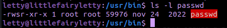

Olhando o comando ``` /usr/bin/passwd ```, esse comando tem por padrão a permissão suid definida. O passwd é um gerenciamento de senhas, tem o suid já definido para que um usuário comum possa alterar suas próprias senhas, pois um usuário comum não tem permissão de alterar um arquivo de sistema no /etc, somendo o root.

Observe o s onde x normalmente indicaria permissões de execução para o usuário.

### SGID (Set Group ID): user + s(pecial)

A permissão SGID pode ser definida em arquivos e diretórios, nos arquivos é semelhante à permissão SUID, mas os privilégios serão os mesmos do proprietário do grupo.

### Como saber se o arquivo tem o suid ou sgid ativado

#### Usando o comando ``` ls -l ```

No lugar o x (executar) vai estar S ou s. A permissão SUID é representada pelo "s" (minúsculo) ou "S" (maiúsculo) na posição do usuário, enquanto a permissão SGID é representada pelo "s" (minúsculo) ou "S" (maiúsculo) na posição do grupo nas permissões de arquivo.

| permissões | explicação |
| ---------- | ---------- |
| ``` -rwsr-xr-x ``` | A permissão SUID está ativada e pode ser executada (letra "s" minúscula na posição do usuário).
| ``` -rwsr-xr-x ``` | A permissão SGID está ativada e pode ser executada (letra "s" minúscula na posição do grupo).

O "s" minúsculo em rws indica a presença do SUID no arquivo, junto com a permissão de execução. Se, no lugar dele, houvesse um "S" maiúsculo (rwS), isso significaria que a permissão de execução presumida não foi definida.

Por exemplo:

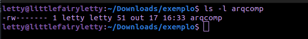

O arquivo arqcomp não tem a permissão de execução no usuário, se atribuirmos a permissão suid, ficará com o S.

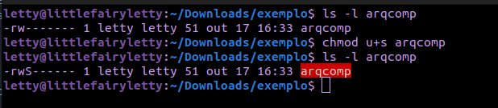

Note que "S" maiúsculo indica que o suid está ativado, mas não tem permissão de execução, para isso permissa atribuir a permissão de execução ao arquivo.

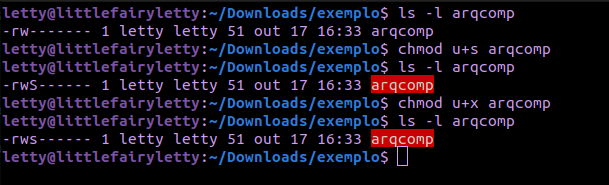

Assim fica o "s" minúsculo com o suid ativado e com permissão de execução.

#### Usando o comando ``` find ```

O comando find pode ser usado para localizar todos os arquivos com permissões SUID ou SGID no sistema.

Exemplo:

| comando | explicação |
| ------- | ---------- |
|``` find / -type f -perm -4000 ```| para encontrar todos os arquivos com permissão SUID |
|``` find / -type f -perm -2000 ```| para encontrar todos os arquivos com permissão SGID |

Numericamente o suid é representado por 4000, e sgid por 2000. Isso será explicado na próxima aula.

#### Usando o comando ``` stat ```

``` bash
stat nome_do_arquivo
```

O comando stat pode ser usado para exibir informações detalhadas sobre um arquivo, incluindo as permissões SUID e SGID.

### Stick bit: other + t(sticky)

O sticky bit é usado em diretórios como para evitar que usuários regulares excluam ou movam arquivos que não sejam seus.

Somente o proprietário do arquivo e o usuário root podem excluir arquivos em um diretório que possua o Sticky bit ativado.

Um exemplo disso é o diretório ``` /tmp ```

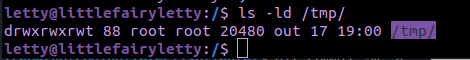

Da mesma forma que se ativarmos o suid e sgid em um arquivo que não tem permissão de execução mostrará o "S" e não o "s", no sticky bit ocorre a mesma coisa. Se o diretório não tiver a permissão **o+x** irá mostrar o "T" e não o "t".

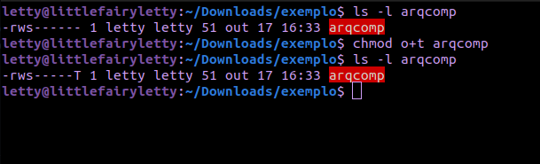

Atribuindo a permissão de execução ao outros:

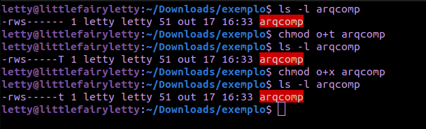

## Extra: alguns comandos utilizados durante a aula

|Comando|Descrição|
|------|------
``` mkdir -p dir1/dir2/dir3 ```| para criar mais de um diretório em um único comando.
``` touch meuarquivo.txt ```| vai criar um  arquivo vazio.
``` touch arquivo1.txt arquivo2.txt arquivo3.txt ```| pode criar mais de um arquivo por vez.
``` ls -l carta ``` | vai listar todos os arquivos que comecem com "**carta...**".
---

## não concluído
