# Aula 05 - Diretórios e Arquivos

## Resumo

```bash
- Mudando permissões de arquivos e diretórios
    - Formato numérico octal
    - Permissões suid
- Extra: Como compilar códigos no linux
```

## Formato numérico octal

O farmato númerico octal é composto por 3 digitos a partir de um conjunto de oito números onde cada número define um tipo de acesso diferente.

|Comando|Descrição|
|------|------|
|```chmod xxx <arquivo ou diretório>```|Altera as permissões do usuário, grupo ou todos para ler, escrever ou executar o arquivo.|
|```chmod -R xxx <diretório>```|Altera a permissão de todos arquivos e diretórios que estão no diretório recursivamente.|

Exemplo:

                                                 R W X

|Binário|Octal|Permissão|
|------|------|------|
|000|0| Nenhum é ativado|
|001|1| Permissão de execução|
|010|2| Permissão de de gravação|
|011|3| Permissão de gravação e execução|
|100|4| Permissão de leitura|
|101|5| Permissão de leitura e execução|
|110|6| Permissão de de leitura e gravação|
|111|7| Permissão de leitura, gravação e execução|

Outra forma de usar o formato octal é somando cada permissão isolada, exemplo:

* __( 4 )__ permissão de leitura.

* __( 2 )__ permissão de gravação.

* __( 1 )__ permissão de execução.

Para atribuir as permissões de leitura e gravação soma 4+2 = 6, ```chmod 6 <arquivo>```

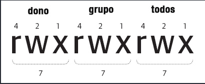

Cada um dos 3 digitos se refere ao usuário, grupo e outros, em sequência. Com isso se usarmos os digitos 777 vamos atribuir todas as permissões ao dono, grupo e outros.

Exemplo:

Se quisermos dar permissão de leitura e gravação ao arqvivo arq.txt é só usarmos o comando:

```bash
chmod 6 arq.txt
```

Números não utilizados são consideramos como 0, então ``` chmod 6 arq.txt ``` é igual a ``` chmod 006 ```, isso quer dizer que as permissões foram atribuídas ao outros, assim como foram tiradas todas as permissões de usuário e grupos.

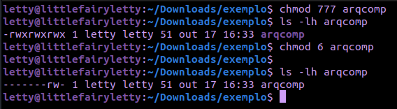

Para atribuir as mesmas permissões ao usuário terar que utilizar os zeros após o número 6, ``` chmod 600 arqcomp ```.

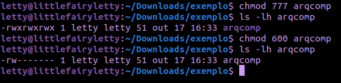

### Exemplos

|Comando|Descrição|
|------|------|
|```chmod 111 <arquivo>```|Todos podem executar o arquivo.|
|```chmod 222 <arquivo>```|Todos podem escrever no arquivo.|
|```chmod 700 <arquivo>```|Somente o dono do arquivo tem todas as permissões.|
|```chmod 600 <arquivo>```|O dono do arquivo pode ler e escrever.|
|```chmod 777 <arquivo>```|Todas as permissões para todos.|

## Permissão SUID, SGID e Sticky bit no formato octal

No formato octal podemos utilizar o quarto digito, na frente dos 3 digitos, para informar uma permissão especial.

Como já foi explicado na aula anterior sobre as permissões especiais aqui só vou ensinar como atribuir uma permissão especial no formato octal.

Funciona da mesma forma que as permissões r, w e x, a sequência para as permissões especiais é suid, sgid e sticky.

|Binário|Octal|Permissão|
|------|------|------|
|000|0| Nenhum é ativado|
|001|1| Ativa apenas o sticky|
|010|2| Ativa apenas o sgid|
|011|3| Ativa o sgid e sticky|
|100|4| Ativa apenas o suid|
|101|5| Ativa apenas o suid e sticky|
|110|6| Ativa o suid e sgid|
|111|7| Ativa todos, suid, sgid e sticky|

Agora é só colocar mais um digito na frente para atribuir uma permissão especial, ``` chmod 4765 arq.txt ```, vai atribuir as permissões de suid ao arquivo, além das permissões leitura, gravação e execução ao dono, leitura e gravação ao grupo e leitura e execução ao outros.

## Permissão suid

A permissão suid é desativada par scripts por motivos de segurança, funcionando apenas para programas compilados.

O script abaixo só poderá ser executado pelo root ou se for chamado de um programada compilado com o suid ligado.

Decidi fazer um script em shell mais simples do que apresentado na aula para começarmos a entender a sintaxe da linguagem shell script.

Então com o modo root crie o arquivo shell:

```bash
su # vai para o modo root, precisa inserir a senha do root
vim arquivoShell.sh # vai abrir um arquivo no vim, precisa salvar depois
```

Outro forma de fazer algo modo root é:

```bash
sudo vim arquivoShell.sh 
```

O comando ``` sudo ``` é uma abreviação do "superuser do", é uma ferramente poderosa usado no sitema unix e unix-like. Ela permite que os usuários executem comandos com privilégios root sem necessariamente estarem no modo root, o que faz ser uma opção mais recomendada.

Porque o sudo é uma opçao mais recomendado do que o su?
Ela é mais segura e pode ser controlada, o usuário tem que estar autorizado a usar o sudo.

Para adicionar um usuário do sistema ao comando sudo é necessário acessar o aquivo ``` /etc/sudoers ```e adcionar o usuário.

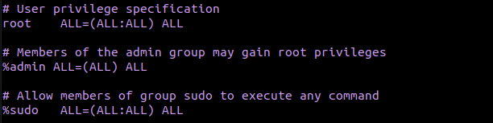

Para saber quais comandos sudo são permitidos ao seu usuário use: ``` sudo -l ```

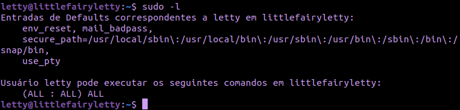

Mas, e o comando ``` su ```?

O comando su é para trocar de usuário, não necessariamente ser usuário root, o “s” significa “swich” e o “u” significa “user”, isto é, “switch user” (trocar de usuário).

Vamos supor que no sistema tenha esses 3 usuário no diretório ``` /home/ ```:

``` bash
ls -1 /home/
arnaldo 
silvio 
shigueo
```

Para trocar de um usuário para outro usamos o comando ``` su ```, assim:

```bash
su arnaldo # vai permitir ir para o usuário arnaldo
```

```bash
su silvio # vai permitir ir para o usuário silvio
```

```bash
sudo su # vai permitir ir para o usuário root
```

Então quando usamos o ``` sudo su ``` estamos trocando de usuário e indo para o usuário root, não necessariamente é um comando que vai para o modo root.

Agora voltando ao script em shell, hehe

```shell
#!/bin/bash
for i in {1..50} #loop que listar de 1 a 50
do 
    echo $i      #echo é equivalente ao printf(""); no C
done
```

Para executar o arquivo que foi criado no modo root use ``` sudo ./arquivoShell ```, verifique se a permissão de execução está ativada para o dono, senão use ``` chmod 700 arquivoShell.sh ```.

Agora, se você tentar executar o arquivo sem usar o comando uso vai dar permissão negada.

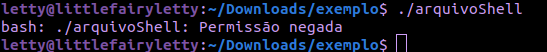

Apenas o dono pode executar o arquivo, e o dono é o root Outra forma de executar esse arquivo, agora não precisando ser root ou usar comando de modo root, é a permissão especial suid.

Execute esse comando:

```bash
chmod 4755 arquivoShell.sh
```

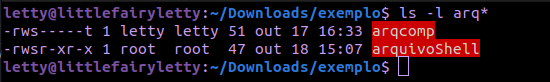

Esse comando vai dar permissão suid, todas as permissões ao dono e permissão de gravação e execução ao grupo e outros.

Agora execute sem precisar usar o comando sudo.

### Trocando o dono e grupo do script

Pode trocar o dono e grupo de um arquivo para outro utilizando o comando ``` chown usuario:grupo <arquivo> ```, assim:

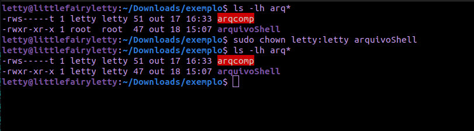

Obs: Utilizando o modo root, use sudo ;)

## Conteúdo extra: compilando códigos no linux

No linux não é necessário utilizar compiladores online ou compiladores como o Pelles C para executar códigos em C ou outras linguagens como C++, Python, Go, Fortran, COBOL, Pascal e etc. Você pode fazer isso utilizando o terminal e instalando um compilador da linguagem que você está usando.

Por exemplo, para instalar o compilador da linguagem C e C++:

```bash
sudo apt install gcc
```

Para compilar os códigos use:

```bash
gcc -o main arquivo.c
./main
```

O que exatamente aconteceu aqui? Vamos com calma, o gcc é um compilador da linguagem C utilizado no linux, -o main, o -o indica o nome do arquivo de saída, o binário gerado, que vai se chamar main, arquivo.c é o seu arquivo com os códigos em C. Então resumindo o compilador gcc vai gerar um arquivo em binário chamado main do arquivo código fonte em C, o arquivo.c.

Primeiro, pelo vim crie o arquivo em C:

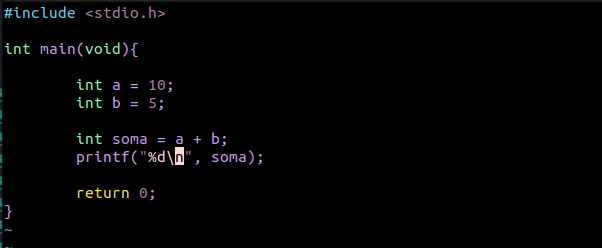

Agora podemos compilar.

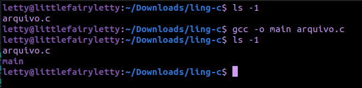

Certo, o gcc gerou o arquivo binário chamado main do meu código fonte, mas e agora? Agora é só executar esse arquivo binário chamado main, assim: ```./ main```.


As outras linguagens de programação tem esses sitema de compilação parecido, por exemplo, o C++ funciona da mesma forma que o gcc, mas é chamado de g++, assim:

```bash
g++ -o main arquivo.cpp # arquivo em cpp por ser c++
./main
```

O linux é uma ótima vantagem para você que é programador por ser leve e rápido de executar os arquvios pelo terminal sem precisar abrir softwares como o pelles C.

Também podemos utilizar o terminal no vscode e compilar os códigos por lá:

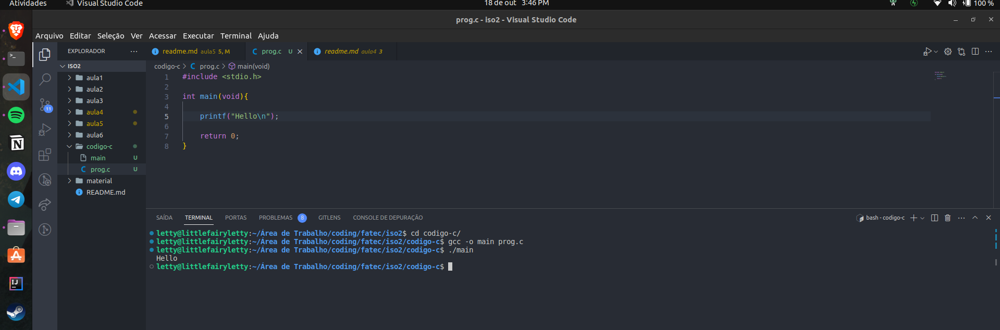

Linguagem Python:

A linguaguem python por ser interpretada e não compilada você deve apenas executar o código, sem precisar gerar um binário, mas tenha o python3 instalado.

Instalando:

```bash
sudo apt install python3
```

Crie um arquivo em python pelo vim ou use vscode:

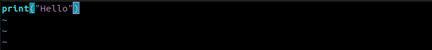

Executando:

```bash
python3 arquivo.py
```

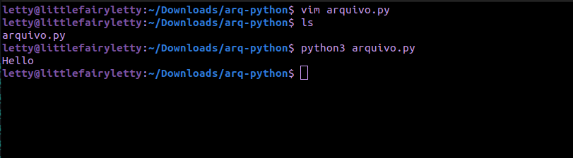

## Bibliografia

* [Guia Linux](https://mateusmuller.me/2019/11/06/sudo-guia-completo-do-comando-sudo-no-linux/)
