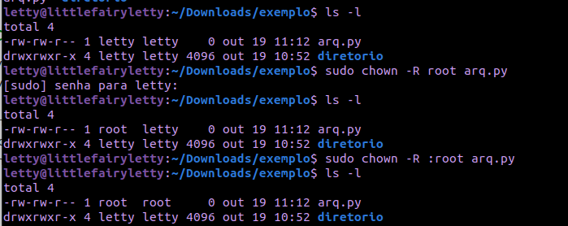

# Aula 06 - Diretórios e Arquivos, Redirecionando a entrada e saída padrão e Metacaracteres e pipes

## Resumo

```bash
- Mudando dono/grupo de arquivos e diretórios
- Permissões geradas por padrão
- Redirecionando a entrada e saída padrão
- Metacaracteres e pipes
    - Matacaracteres
```

## 7.4) Mudando dono/grupo de arquivos e diretórios

O dono e o grupo de um arquivo ou diretório pode ser altera pelo root usando os comandos ``` chown ``` e ``` chgrp ```.

### CHOWN

Esse comando permite trocar o dono e grupo de um arquivo/diretório.

| Comando | Descrição
| ------- | ---------
``` chown dono:grupo <arquivo> ou <diretório> ``` | altera o dono e grupo de um arquivo/diretório
| ``` chown -R dono <arquivo> ou <dir> ``` | altera apenas o dono do arquivo/diretório
|``` chown -R :grupo <arquivo> ou <dir> ```| altera apenas o grupo do arquivo ou diretório
``` chown - R dono:grupo <arquivo> ou <diretório> ``` | altera o dono e grupo recursivamente

Enquanto comando ``` chown dono:grupo dir1 ``` altera apenas o diretório dir1, o comando ``` chown -R dono:grupo dir1 ``` vai alterar o diretório dir1 e tudo que estiver dentro do diretório.



### CHGRP

O comando chgrp altera o grupo de um arquivo.

| Comando | Descrição
| ------- | ---------
|``` chgrp grupo <arquivo> ```| altera o grupo do arquivo
| ``` chgrp -R grupo <arquivo> ``` | altera recursivamente

Obs:

O **chgrp** altera apenas o **grupo** de **arquivos**.

O **chown** altera **dono e grupo** de **arquivos e diretórios**.

O **chmod** altera as **permissões** de **arquivos e diretórios**.

## 7.5) Permissões geradas por padrão

**em andamento**
