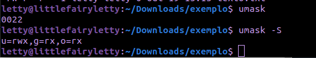

# Aula 06 - Diretórios e Arquivos, Redirecionando a entrada e saída padrão e Metacaracteres e pipes

## Resumo

```bash
- Mudando dono/grupo de arquivos e diretórios
- Permissões geradas por padrão
- Redirecionando a entrada e saída padrão
- Metacaracteres e pipes
    - Matacaracteres
```

## 7.4) Mudando dono/grupo de arquivos e diretórios

O dono e o grupo de um arquivo ou diretório pode ser altera pelo root usando os comandos ``` chown ``` e ``` chgrp ```.

### CHOWN

Esse comando permite trocar o dono e grupo de um arquivo/diretório.

| Comando | Descrição
| ------- | ---------
``` chown dono:grupo <arquivo> ou <diretório> ``` | altera o dono e grupo de um arquivo/diretório
| ``` chown -R dono <arquivo> ou <dir> ``` | altera apenas o dono do arquivo/diretório
|``` chown -R :grupo <arquivo> ou <dir> ```| altera apenas o grupo do arquivo ou diretório
``` chown - R dono:grupo <arquivo> ou <diretório> ``` | altera o dono e grupo recursivamente

Enquanto comando ``` chown dono:grupo dir1 ``` altera apenas o diretório dir1, o comando ``` chown -R dono:grupo dir1 ``` vai alterar o diretório dir1 e tudo que estiver dentro do diretório.


### CHGRP

O comando chgrp altera o grupo de um arquivo.

| Comando | Descrição
| ------- | ---------
|``` chgrp grupo <arquivo> ```| altera o grupo do arquivo
| ``` chgrp -R grupo <arquivo> ``` | altera recursivamente

Obs:

O **chgrp** altera apenas o **grupo** de **arquivos**.

O **chown** altera **dono e grupo** de **arquivos e diretórios**.

O **chmod** altera as **permissões** de **arquivos e diretórios**.

## 7.5) Permissões geradas por padrão

No linux as permissões de acesso de um arquivo ou diretório tem um padrão de atribuição quando são criadas.

#### Permimssão padrão de um arquivo

Os arquivos têm como permissão padrão o 666, ou seja, permissão de leitura, gravação para todos usuário do sistema.

#### Permimssão padrão de um diretório

Já os diretórios as permissões padrão são 777, permissão de leitura, gravação e acesso para todos usuário do sistema.

Essas permissões padrão são definidas pelo valor da máscara de permissão padrão do sistema, como foi explicado, mas podem ser influenciadas se usado o comando umask. Por exemplo:

A umask padrão do sistema Debion e Ubuntu é 002, isso significa que as permissões padrão de um arquivo binário são, ``` -r-xr-xr-x ```, e os arquivos texto são ``` -rw-rw-r-- ``` e os diretórios são ``` drwxr-xr-x ```.

A umask tem efeito diferente caso o arquivo seja binário(programa executável) ou texto.

Veja a tabela:

| Umask | Arquivo Binário | Arquivo Texto | Diretório
| --- | --- | --- | --- |
0 | r-x | rw- | rwx
1 | r-- | rw- | rw-
2 | r-x | r-- | r-x
3 | r-- | r-- | r--
4 | --x | -w- | -wx
5 | --- | -w- | -w-
6 | --x | --- | --x
7 | --- | --- | ---

Para saber qual a definição da umask do seu sistema linux use o comando ``` umask ```, para ver a representação simbólica use ``` usmak -S ```


obs: a representação simbólica demonstrada é de diretórios.

Mas de onde vem a lógica dessa tabela?

**em andamento**
